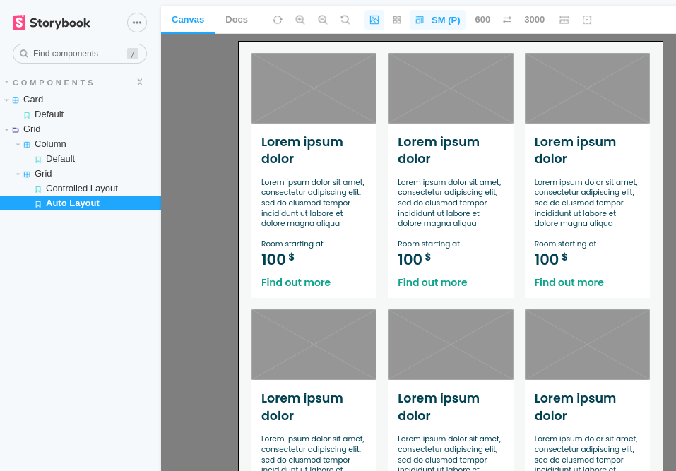

<h2 align="center">
Grid + Card Assignment
</h2>

<p align="center">
[Old README.md file](archive/README-old.md)
</p>

<p align="center">
	
</p>

### Table of Contents

- [Table of Contents](#table-of-contents)
- [Requirements](#requirements)
- [How to run this project?](#how-to-run-this-project)
- [Implementation notes](#implementation-notes)
- [Feedback](#feedback)

### Requirements

- Mandatory `Grid` component
- `Grid` component should expose a minimal grid framework that improves upon the earlier implementation with the following features:
  - Safer `flexbox` properties for better browser support
  - Automatic layout based on grid parameters and automatic column overflow control (automatic transfer of columns to the next line)
  - Column width control per breakpoint
  - Content-independent column width control
- Optional `Card` component
- `Storybook` version `(6.5.*)`
- No external `CSS` frameworks like `Bootstrap` and `Tailwind`
- Vanilla `React`

### How to run this project?

- Clone

  ```
  # with SSH
  git clone git@github.com:bogus7000/storybook-grid-assignment.git

  # with HTTPS
  git clone https://github.com/bogus7000/storybook-grid-assignment.git
  ```

- Install dependencies

  ```
  npm install
  ```

- Run `Storybook`

  ```
  npm run storybook
  ```

- Inspect components

  ```
  Local: http://localhost:6006/
  Network/WSL: http://172.18.8.78:6006/
  ```

### Implementation notes

- Moved away from vanilla `CSS` to `SASS`

- `Grid`, `Row` and `Column` components can be used to lay the grid out, for example:

  ```
  <Grid>
    <Row>
      <Column xsm={4} sm={6} md={3} lg={6} xlg={6}>
        <Card></Card>
      </Column>
      <Column xsm={4} sm={6} md={3} lg={6} xlg={6}>
        <Card></Card>
      </Column>
      <Column xsm={4} sm={6} md={3} lg={6} xlg={6}>
        <Card></Card>
      </Column>
    </Row>
  </Grid>
  ```

- `Grid` is a mandatory component
- `Row` is a mandatory component
- `Column` is a mandatory component. Use one or more of its props to specify column span for selected breakpoints. For example: `xsm={4}`. Use `xsm={0}` span to hide
- Ignore props to use auto layout. Auto layout respects `min-column-span`, as specified in the design doc:

  - `xsm`, `sm` and `md`: 2
  - `lg` and `xlg`: 3

- Automatic `Column` overflow control is supported
- `Card` component supports responsive typography and spacing (with `SASS variables`)

### Feedback

- Neither `Normalize.css`, nor `Reset.css` is used to "preset" any styles. When building a custom design system, it is beneficial to start working on a consistent, clean sheet, instead of fighting with user-agent defaults. From my experience, it is easier to achieve what you call the "pixel-perfect implementation" this way. `Normalize.css` is for consistency, `Reset.css` is for getting a clean sheet

- `Flexbox column-gap` property has roughly the same support in Safari, as it does in Chrome, Firefox and Edge. `caniuse.com` data points to `92.86%` coverage of global users. I believe this to be sufficient, unless compatibility with browsers older than `2020` is required explicitly. Regardless, in hindsight, I can see how one could expect older browsers to be supported by default, so my initial choice should've been different. Consider including in the requirements for future assignments

- Layout control capabilities were not obvious to me from the requirements I have received. Consider including in the requirements for future assignments
