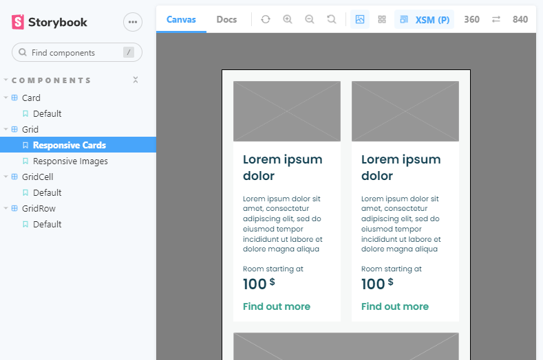

<h2 align="center">
Grid + Card Assignment
</h2>

<p align="center">
Hey there, how are you today? 
</p>

<p align="center">
	
</p>

### Table of Contents

- [Table of Contents](#table-of-contents)
- [Requirements](#requirements)
- [How to run this project?](#how-to-run-this-project)
- [Implementation notes](#implementation-notes)
- [Feedback](#feedback)

### Requirements

Please read the [Feedback](#feedback) section for details on how I settled on these. Here's my list:

- Mandatory `Grid` component
- `Grid` component controls arbitrary elements, is responsive
- Optional `Card` component
- `Storybook` version `(6.5.*)`
- Vanilla `CSS`. No external `CSS` frameworks like `Bootstrap` and `Tailwind`
- Vanilla `React`
- Make it happen: simple and ASAP

### How to run this project?

- Clone

  ```
  # with SSH
  git clone git@github.com:bogus7000/storybook-grid-assignment.git

  # with HTTPS
  git clone https://github.com/bogus7000/storybook-grid-assignment.git
  ```

- Install dependencies

  ```
  npm install
  ```

- Run `Storybook`

  ```
  npm run storybook
  ```

- Inspect components

  ```
  Local: http://localhost:6006/
  Network/WSL: http://172.18.8.78:6006/
  ```

### Implementation notes

- All component respect the following breakpoints. This is reflected in the `Storybook` viewport config as well:

  ```
  XSM: 360+
  SM: 600+
  MD: 800+
  LG: 1024+
  XLG: 1288+
  ```

- `Grid`, `GridRow` and `GridCell` components can be used to lay the grid out, for example:

  ```
  <Grid>
  <GridRow>
  	<GridCell>
  		<Card />
  	</GridCell>
  	<GridCell>
  		<Card />
  	</GridCell>
  	<GridCell hideBelow="sm">
  		<Card />
  	</GridCell>
  	<GridCell hideBelow="lg">
  		<Card />
  	</GridCell>
  </GridRow>
  </Grid>
  ```

- Implemented with `flexbox` and `column-gap` property + `media queries`. Simple and ASAP
- `Grid` is a mandatory component. It encapsulates the grid container styles, adjusts the grid based on the `breakpoint`, and expects `GridRow` components to be passed down as children
- `GridRow` is a mandatory component. It encapsulates the grid row styles, auto-adjusts to the number of children and expects some components to be passed down as children. It provides the optional `hideBelow` prop. Use it like: `hideBelow="sm"` to hide the whole row below a certain `breakpoint`
- `GridCell` is an optional component. It provides the optional `hideBelow` prop. Use it like: `hideBelow="sm"` to hide single grid elements below a certain `breakpoint`
- Among other props, `Card` component provides `transparent` prop to control the background modifier (with and without the background)
- `Card` component supports responsive typography and spacing (with `CSS variables`)
- I've applied `reset` + `normalize` technique to make my life a bit easier
- Props are wired up. You can play around with them in the `Controls` view inside `Storybook`

### Feedback

- In the future, please consider including more details about how styles are expected to be managed. `CSS-in-JS`? Pre-processors like `SASS` perhaps? In the end, I decided to use `Vanilla CSS` with `flexbox` and `media queries`, as it seemed like that's what was required for this assignment. Plus I needed to get this done ASAP, and this seemed like a good-enough option that would let me kick this off immediately :)

- `Grid` component spec may be interpreted in several different ways. At first, I thought that this grid is specifically targeted at images, since you've specified pixel density for some of the grid items `(599x315 @2x)`. Later, as I was inspecting the `Card` component spec, I noticed that the same grid is used to align cards. To be honest, I am still not 100% sure what is expected here. Regardless, my grid supports both cases. There's the `ResponsiveImages` story for images, and the `ResponsiveCards` story for cards

- Moreover, I'm not sure about the grid container element, and how the space around the grid should be handled. At `@360+`, should the grid container pin the grid to exactly `360px` width, with white space outside the grid expanding towards the left and right edges of the viewport, as the viewport width increases (sort of like the popular `margin: auto` technique)? In the end, I decided that the grid will stretch out to fill the width of the viewport, as I believe this to be more desired UX-wise. Sorry if I got it wrong here :)

- The `Card` component spec IMO is too general to demand pixel-perfect implementation :). Please consider sharing Figma design files, or similar, for future assignments :)

- Humongous THANKS for your time, I've enjoyed this one a lot! Cheers!
